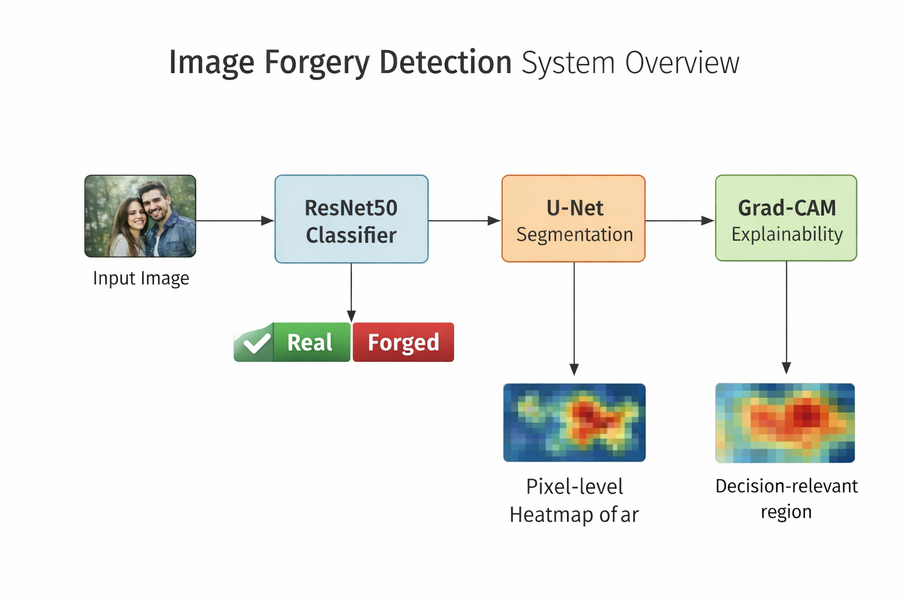
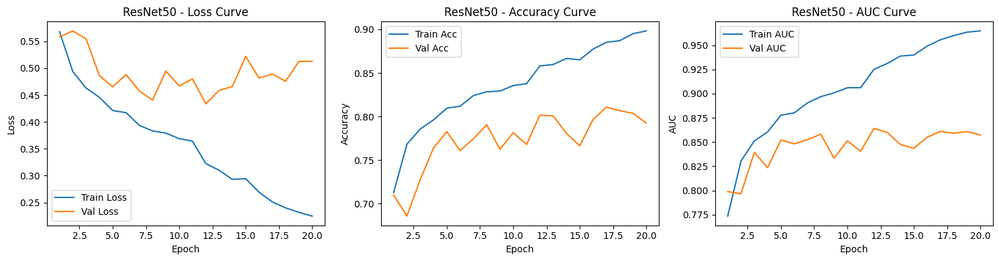
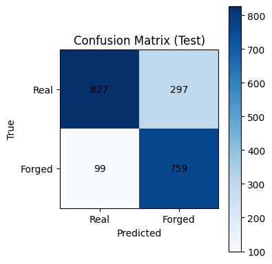
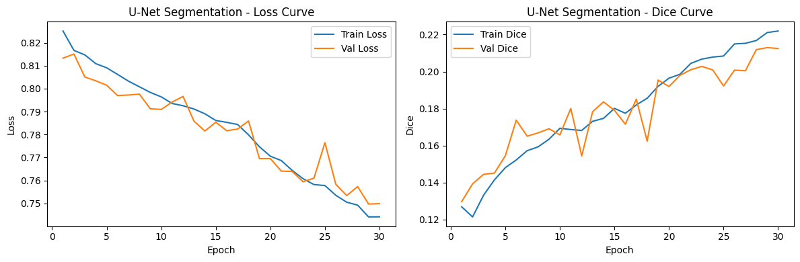
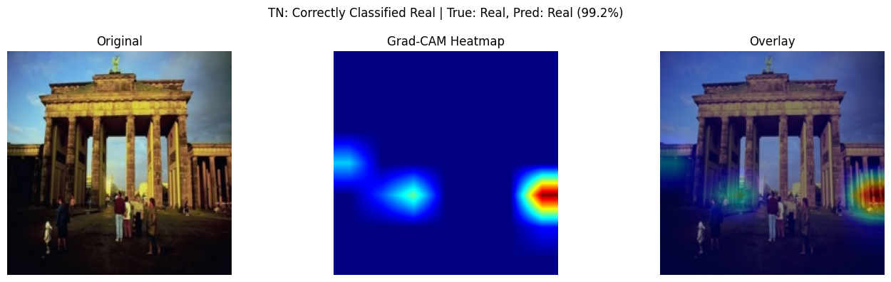
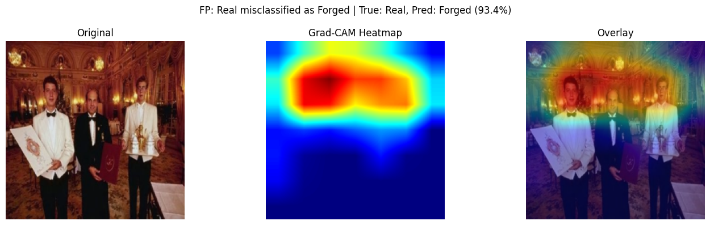

# Image Forgery Detection: ResNet50 + U-Net + Grad-CAM

An explainable deep-learning framework for image forgery detection and localization — combining **classification**, **pixel-level segmentation**, and **visual interpretability** in one unified pipeline for trustworthy forensic analysis.



## The pipeline

1. **ResNet50 classifier** — every input image is classified as real or forged.
2. **U-Net segmentation** — images flagged as forged go through pixel-level localization of the manipulated region.
3. **Grad-CAM explainability** — heatmaps show which regions drove the classifier's decision, so the verdict is auditable, not a black box.

## Results (CASIA 2.0)

| Task | Metric | Score |
|---|---|---|
| Classification | Accuracy | 80.32% |
| Classification | AUC | 0.86 |
| Classification | Forged recall | 0.88 |
| Classification | F1 | 0.80 |
| Segmentation | Dice | ~0.21 |
| Segmentation | IoU | ~0.15 |

High forged-image recall (0.88) is the metric that matters most here — in forensics, a missed forgery is worse than a false alarm. Segmentation scores are modest, consistent with CASIA 2.0's extremely small manipulated regions and noisy ground-truth masks. Grad-CAM confirms the classifier keys on texture inconsistencies, boundary artifacts, and splicing regions — genuine forensic cues.

## Results analysis

### Classifier training dynamics



Over 20 epochs, training loss falls steadily (0.56 → 0.22) and training accuracy climbs to ~0.90. Validation loss drops early, then plateaus around 0.44–0.52 with fluctuations after epoch 8, while validation accuracy settles near 0.79–0.81 and validation AUC holds at ~0.86. The widening train/val gap is mild overfitting — the model keeps memorizing training samples after validation stops improving — which is why the final checkpoint is selected on validation performance, not the last epoch.

### Test confusion matrix



On the 1,982-image test set (1,124 real / 858 forged):

- **Accuracy 80.0%** — 1,586 correct, in line with the reported 80.32%
- **Forged recall 88.5%** — 759 of 858 forgeries caught; only 99 missed
- **Forged precision 71.9%** — 297 false alarms out of 1,056 forged predictions
- **F1 ≈ 0.79**

The error pattern is deliberate in effect: false positives (297) outnumber false negatives (99) roughly 3-to-1. For a forensic screening tool that trade-off is correct — a flagged real image gets human review, a missed forgery does not.

### Segmentation training dynamics



Over 30 epochs, both training and validation loss decline together (0.82 → ~0.75) and the Dice score climbs from ~0.13 to ~0.22 (train) / ~0.21 (val). Validation Dice is noisy — expected with tiny forged regions and imperfect masks — but it tracks the training curve upward with no divergence, so the network is genuinely learning rather than overfitting. The low absolute Dice is a data ceiling, not a training failure: when the tampered region is a few dozen pixels and the ground-truth masks are noisy, even a good localizer scores low.

### Explainability spot-checks



*Correctly classified real (99.2%).* Activation is sparse and localized with no coherent tampering pattern — nothing in the image looks spliced, and the heatmap agrees.



*Real image misclassified as forged (93.4%).* The heatmap fires intensely across faces and the ornate interior — strong lighting contrasts, chandeliers, and fine facial textures mimic the boundary/texture artifacts the model associates with tampering. This is exactly the failure mode noted in the report: the classifier is sensitive to complex natural textures and lighting, and Grad-CAM makes that failure auditable instead of silent.

## Methods

**Classifier** — ResNet50 pretrained on ImageNet, original FC layer replaced with a custom head (2048→256, batch norm, ReLU, dropout, 256→1). Trained with `BCEWithLogitsLoss` and class weighting (`pos_weight`) for the real/forged imbalance; augmentation includes rotation, cropping, color jitter, and blur. Decision threshold tuned on the validation set.

**Segmentation** — U-Net trained from scratch on forged images with ground-truth masks (filename-normalized image–mask pairing), optimized with combined BCE + Dice loss to handle severe foreground–background imbalance.

**Explainability** — Grad-CAM applied to the trained classifier at inference time.

## Dataset

[CASIA 2.0 Image Tampering Dataset](https://www.kaggle.com/datasets/divg07/casia-20-image-tampering-detection-dataset) — 12,000+ authentic and tampered images (copy–move and splicing) with binary ground-truth masks for a subset. Classification split 70/15/15 stratified (train: 5,243 real / 4,002 forged); segmentation pairs split 80/20.

## Repository contents

- `Image_Classification_Segmentation_CASIA2_ResNet50.ipynb` — the full pipeline: data loading, ResNet50 classifier, threshold tuning, U-Net segmentation, Grad-CAM visualization
- `assets/` — system diagram, training curves, confusion matrix, and Grad-CAM examples
- `docs/Image_Forgery_Detection.pdf` — project report

## Quickstart

Both notebooks are designed for Google Colab with a GPU runtime. They expect the CASIA 2.0 dataset on Google Drive (see `DATA_ROOT` in cell 2 of each notebook and adjust the path).

```bash
pip install torch torchvision opencv-python matplotlib tqdm scikit-learn
```

## Limitations & future work

- U-Net localization is constrained by noisy CASIA 2.0 masks and tiny forged regions; a pretrained encoder should help.
- Occasional false positives on strong shadows, lighting variation, and complex textures.
- CASIA covers copy–move/splicing only — generalization to deepfakes and AI-generated images needs broader training data.
- Next step: real-time forensic verification tool.

## References

- He et al. Deep Residual Learning for Image Recognition. *CVPR*, 2016. (ResNet50)
- Ronneberger et al. U-Net: Convolutional Networks for Biomedical Image Segmentation. *MICCAI*, 2015.
- Selvaraju et al. Grad-CAM: Visual Explanations from Deep Networks via Gradient-based Localization. *ICCV*, 2017.
- Dong et al. CASIA Image Tampering Detection Evaluation Database. *IEEE ChinaSIP*, 2013.

## Author

Musfikur Rahaman — PhD student, UA Little Rock
